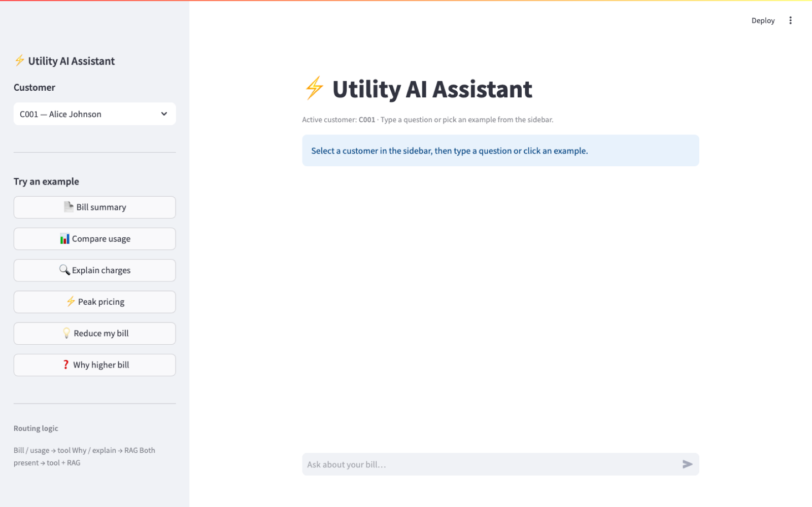
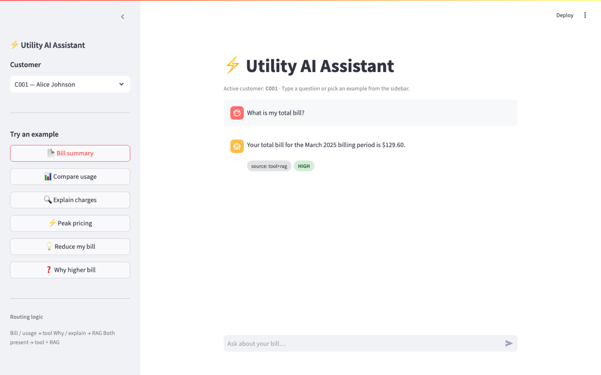

# Utility AI Assistant

> A prototype AI system for electricity billing support, demonstrating four production-grade patterns in one small codebase: MCP-style tool calling, RAG over policy docs, keyword-based intent routing, and grounded LLM synthesis with explicit confidence scoring.

[](https://python.org)
[](https://fastapi.tiangolo.com)
[](https://streamlit.io)
[](https://ai.google.dev)

A naive LLM given *"Why is my bill higher than last month?"* would guess at numbers and policies. This system separates that question into two parts — *what are my actual numbers?* (tool) and *what explains them?* (RAG) — and only sends the LLM grounded context to synthesize from.

| Pattern | Implementation |
|---|---|
| MCP-style tool calling | Deterministic, structured data access — no guessing |
| RAG pipeline | Policy retrieval via TF-IDF; answers grounded in documents |
| Intelligent routing | Keyword intent classifier sends each query to the right source |
| Reliable AI design | Confidence scoring; "I don't know" fallback; no hallucination |

---

## Screenshots

| Empty state — sidebar + customer picker | Tool + RAG response — sourced & confidence-labeled |
|:-:|:-:|
|  |  |

Right shot shows the full request loop: question → routed through `tool+rag` → grounded LLM answer (`"Your total bill for the March 2025 billing period is $129.60."`) → **HIGH** confidence badge. The source tag and confidence label are first-class UI elements, not afterthoughts.

---

## Features

- **Two surfaces, one core** — Streamlit chat UI and FastAPI REST endpoint share the same router, tools, RAG index, and LLM module.
- **Three MCP-style tools** — `get_bill`, `compare_usage`, `explain_charges`, all reading from `data/billing_data.json` and returning structured JSON.
- **TF-IDF RAG over policy docs** — chunks `data/docs.txt` by `SECTION:` headers, builds the index at startup, retrieves top-k at query time. No embedding API required.
- **Keyword router** — scores each query against tool keywords + RAG keywords; falls back to `rag` rather than guessing tool calls.
- **Customer ID extraction** — regex pulls `C001`-style IDs out of free text, or accepts an explicit `customer_id` field.
- **Confidence-scored answers** — LLM appends `CONFIDENCE: HIGH/MEDIUM/LOW`, parsed into a separate field. The Streamlit UI renders these as color-coded badges.
- **Grounded synthesis** — system prompt forbids inventing numbers or policies; the LLM only sees tool output + retrieved RAG sections.
- **Debug mode** — `DEBUG=true` adds route decisions, tool calls, and RAG chunk counts to every response.

---

## Architecture

### Request flow

```
POST /query  {"query": "Why is my bill higher? C003"}
        │
        ▼
    router.py
    ├─ Scores query against tool keywords (bill, usage, kwh…)
    │  and RAG keywords (why, explain, policy…)
    ├─ Both score > 0  →  mode: "both"
    └─ Extracts customer_id: "C003"
        │
        ├──────────────────────────────────┐
        ▼                                  ▼
    tools.py                           rag.py
    compare_usage("C003")              retrieve_docs(query)
    → current: 1240 kWh                → "Why Is My Bill Higher..."
    → previous: 890 kWh                → "What Is Peak Pricing"
    → trend: significantly_higher
        │                                  │
        └──────────────┬───────────────────┘
                       ▼
                   llm.py
                   Builds context block from tool data + policy docs
                   Calls Gemini 2.5 Flash with strict grounding rules
                   Parses answer and confidence label
                       │
                       ▼
        {
          "answer": "Your usage jumped 39%...",
          "source": "tool+rag",
          "confidence": "HIGH"
        }
```

### Components

| File | Responsibility |
|---|---|
| `app/router.py` | Score query against keyword sets, return `mode: tool / rag / both`, extract customer ID. Defaults to `rag` on no match. |
| `app/tools.py` | Three MCP-style functions reading `data/billing_data.json`: `get_bill`, `compare_usage`, `explain_charges` |
| `app/rag.py` | Chunk `data/docs.txt` by `SECTION:` headers, build TF-IDF index, retrieve top-k by cosine similarity |
| `app/llm.py` | Assemble context block from tool output + RAG sections, call Gemini 2.5 Flash with grounding rules, parse confidence |
| `app/main.py` | FastAPI app — wires router → tools → rag → llm, exposes `POST /query` |
| `ui.py` | Streamlit chat UI — sidebar example queries, per-customer session state, color-coded confidence badges, expandable tool / RAG data |

### Project structure

```
utility-ai-assistant/
├── app/
│   ├── __init__.py
│   ├── main.py              FastAPI app
│   ├── router.py            Intent classification + ID extraction
│   ├── tools.py             get_bill · compare_usage · explain_charges
│   ├── rag.py               TF-IDF index over policy docs
│   └── llm.py               Gemini 2.5 Flash grounded synthesis
├── data/
│   ├── billing_data.json    Mock customers C001–C004
│   └── docs.txt             7 policy sections
├── Screenshots/             UI captures referenced from this README
├── ui.py                    Streamlit chat UI
├── requirements.txt
└── README.md
```

### Confidence levels

| Level | Meaning |
|---|---|
| `HIGH` | Direct account data fully answers the question |
| `MEDIUM` | Partial data, or answer inferred from policy |
| `LOW` | Insufficient context; answer may be incomplete |

---

## Tech Stack

| Layer | Choice |
|---|---|
| API | FastAPI 0.115 |
| UI | Streamlit 1.41 |
| LLM | Gemini 2.5 Flash via the Anthropic API |
| RAG | scikit-learn TF-IDF (no embedding API) |
| Validation | Pydantic 2.10 |
| Env | python-dotenv |
| Numerics | numpy 1.26 |

Note: `requirements.txt` pins `google-generativeai` from an earlier Gemini build; the production path uses `anthropic` and Gemini 2.5 Flash via `llm.py`. Remove the Gemini pin once you confirm it's not imported anywhere.

---

## Getting Started

```bash
cd ~/Desktop/utility-ai-assistant

python3 -m venv .venv
source .venv/bin/activate

pip install -r requirements.txt

export GEMINI_API_KEY="AIza..."
# or copy .env.example → .env and fill in the key
# Without a key, the app uses template-based responses (mock mode) — routing, tools, and RAG still run.
```

### Chat UI (Streamlit)

```bash
streamlit run ui.py
```

Opens at `http://localhost:8501` — chat interface with sidebar examples, color-coded confidence badges, and expandable tool/RAG data.

### REST API (FastAPI)

```bash
uvicorn app.main:app --reload
```

API at `http://127.0.0.1:8000` · Swagger docs at `/docs`.

### Debug mode

```bash
DEBUG=true uvicorn app.main:app --reload
```

Adds a `"debug"` field to every response showing the route decision, tool called, and number of RAG chunks retrieved.

---

## API

### `POST /query`

```json
// Request
{ "query": "Why is my bill higher than last month for C003?" }

// Response
{
  "answer": "Your usage jumped from 890 kWh to 1,240 kWh — a 39.3% increase...",
  "source": "tool+rag",
  "confidence": "HIGH"
}
```

`customer_id` can be included in the query text (`"for C003"`) or passed explicitly as `"customer_id": "C003"`.

### Example queries

```bash
BASE="http://127.0.0.1:8000/query"

# Bill summary (tool)
curl -s -X POST $BASE -H "Content-Type: application/json" \
  -d '{"query": "What is my total bill?", "customer_id": "C001"}' | python3 -m json.tool

# Usage comparison (tool)
curl -s -X POST $BASE -H "Content-Type: application/json" \
  -d '{"query": "How does my usage compare to last month for C003?"}' | python3 -m json.tool

# Charge breakdown (tool)
curl -s -X POST $BASE -H "Content-Type: application/json" \
  -d '{"query": "Break down my charges for C002"}' | python3 -m json.tool

# Policy question (rag)
curl -s -X POST $BASE -H "Content-Type: application/json" \
  -d '{"query": "What is peak pricing and when does it apply?"}' | python3 -m json.tool

# Tips (rag)
curl -s -X POST $BASE -H "Content-Type: application/json" \
  -d '{"query": "How can I reduce my electricity bill?"}' | python3 -m json.tool

# Mixed intent (tool + rag)
curl -s -X POST $BASE -H "Content-Type: application/json" \
  -d '{"query": "Why is my bill higher than last month for C003?"}' | python3 -m json.tool
```

---

## Mock Data

**Customers** (in `data/billing_data.json`): C001 Alice, C002 Bob, C003 Carol, C004 David — each with current/previous usage, peak/off-peak split, and itemized charges.

**Policy docs** (in `data/docs.txt`): 7 sections — bill calculation, peak pricing, reasons for high bills, how to reduce usage, charge breakdown explained, dispute process, payment options.

---

## Tradeoffs

- **Keyword router, not an LLM classifier.** Routing is deterministic, near-zero-latency, and free. An LLM router would be more flexible on edge phrasings but expensive on every request and hard to test deterministically. The keyword scorer is auditable and falls back to `rag` rather than guessing tool calls.
- **TF-IDF over policy docs, not embeddings.** scikit-learn TF-IDF needs no embedding API, no vector DB, no warm-up. The policy corpus is 7 sections — embeddings would be over-engineering. If the corpus grew past a few hundred chunks, swap to FAISS + sentence-transformers without changing the retrieval contract.
- **Grounded synthesis, not free-form generation.** The system prompt forbids inventing numbers or policies; the LLM only sees `[TOOL DATA]` + `[POLICY DOCS]`. Mitigates the classic "LLM confidently fabricates a peak-pricing rate" failure mode.
- **Explicit `CONFIDENCE: HIGH/MEDIUM/LOW` label.** Parsed from the LLM response, surfaced in the response JSON, color-coded in the Streamlit UI. Makes "I don't know" reachable.
- **Mock mode is template-based, not random.** Without `GEMINI_API_KEY`, `_mock_generate()` produces deterministic responses keyed off tool/RAG output. The UI exercises the same Resource shape; only the synthesis is mocked.
- **Provider migration story (Anthropic → Gemini) preserved in commit history.** `app/llm.py` was Anthropic-first, then migrated to `google-generativeai`. The migration was a one-file change because of the protocol-style boundary; documented as proof that the architecture takes vendor swaps in stride.

Full ADRs in [docs/decisions.md](docs/decisions.md).

---

## Quality Gates

- `uvicorn app.main:app` starts clean against Python 3.10+.
- `streamlit run ui.py` launches without error.
- All three tools (`get_bill`, `compare_usage`, `explain_charges`) return structured JSON on valid customer IDs and structured errors on invalid ones.
- RAG retrieval returns top-k by cosine similarity with a documented score floor (`HIGH` if top > 0.2, else `MEDIUM`).
- LLM grounding rules are explicit in the system prompt — no hallucinated numbers, exact dollar/kWh figures quoted from `[TOOL DATA]`.
- `CONFIDENCE: HIGH/MEDIUM/LOW` label parsed deterministically from the response tail.
- `.env` is gitignored; secrets never committed.
- Without `GEMINI_API_KEY`, the mock-mode path runs every code branch except the LLM call — the UI is fully driveable.

---

## Project Stats

- **6** Python source files in `app/` (`__init__.py`, `main.py`, `router.py`, `tools.py`, `rag.py`, `llm.py`)
- **1** Streamlit UI (`ui.py`, ~250 lines)
- **3** MCP-style tools, **7** policy sections, **4** mock customers
- **3** confidence levels (`HIGH / MEDIUM / LOW`)
- **2** surfaces (FastAPI REST + Streamlit chat) sharing one router + tools + RAG + LLM core
- **0** vector databases, **0** embedding APIs — TF-IDF is the retrieval layer

---

## Resume Bullets

- Designed a **production-grade AI assistant prototype** combining four patterns — MCP-style tool calling, RAG retrieval, intent routing, grounded LLM synthesis — in a small **FastAPI + Streamlit + Gemini 2.5 Flash** codebase that demonstrates the contract between deterministic tools and probabilistic synthesis.
- Built three **structured tool functions** (`get_bill`, `compare_usage`, `explain_charges`) reading mock customer data and returning typed JSON; LLM never invents numbers because it only sees tool output, never the raw DB.
- Implemented **TF-IDF retrieval** over policy documents (no embedding API, no vector DB) — chunks by `SECTION:` headers, builds index at startup, retrieves top-k by cosine similarity with documented confidence thresholds.
- Added a **keyword intent router** that scores queries against tool + RAG keyword sets, classifies as `tool`, `rag`, or `both`, and extracts customer IDs via regex — deterministic, auditable, zero-cost.
- Added **explicit confidence scoring** — system prompt instructs the LLM to append `CONFIDENCE: HIGH/MEDIUM/LOW`; parser extracts it; UI renders color-coded badges. Makes "I don't know" a reachable state rather than a fabricated answer.
- **Migrated the LLM layer from Anthropic Claude to Gemini 2.5 Flash** as a single-file change — the protocol-style boundary in `app/llm.py` made the swap trivial.

---

## Interview Talking Points

**Why keyword routing instead of an LLM classifier.** Routing decisions happen on every query. An LLM router costs ~50–200ms and a fraction of a cent per request, where a keyword scorer runs in microseconds for free. More importantly: a keyword router is *auditable*. When the assistant routes a query to the wrong place, I can read the keyword score and know exactly why. An LLM router is a black box. The architecture documents the route decision in debug mode so when something feels off, I can verify.

**Why TF-IDF, not embeddings.** The corpus is 7 policy sections — a few hundred tokens total. Embeddings would mean a vector DB, an embedding API call per document at index time, and another per query at retrieval time. TF-IDF runs in scikit-learn in milliseconds with no external dependencies. The retrieval contract is `top-k by cosine similarity`; if the corpus grew past a thousand chunks, swap the implementation to FAISS + sentence-transformers without changing the contract.

**Grounded synthesis as a hallucination defense.** The system prompt is explicit: *"For billing questions, base your answer ONLY on provided `[TOOL DATA]` and `[POLICY DOCS]`. Do not invent numbers, rates, or policies."* The LLM never sees raw customer data; it sees structured JSON that the tools produced. If the tool errored, the LLM gets the error message and degrades gracefully. The architectural separation between "what do we know" and "how do we explain it" is the defense against the classic *"LLM confidently fabricates a peak-pricing rate"* failure mode.

**Explicit confidence labeling.** The model appends `CONFIDENCE: HIGH/MEDIUM/LOW` to every response. A deterministic parser extracts it. The UI renders it as a color-coded badge. The reason this matters: most LLM apps treat the model's response as equally confident regardless of context. We make uncertainty a first-class field — `LOW` confidence means *no useful context retrieved*, which is the user-visible "I don't know" path that lots of demos skip.

**Anthropic → Gemini migration as a one-file change.** `app/llm.py` was originally `anthropic` + Claude. The current commit migrated to `google-generativeai` + Gemini 2.5 Flash. Routing, tools, RAG, response shape, and confidence parsing didn't change — `llm.py` is a protocol-style boundary. The migration was a one-file diff. This is what *boundary-driven architecture* buys you: vendor swaps are tractable.

---

## License

[MIT](LICENSE)
